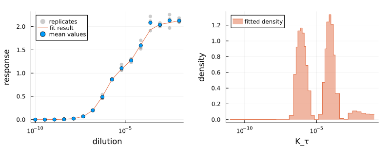

# AntibodyMethodsDoseResponse.jl

[](https://translational-pain-research.github.io/AntibodyMethodsDoseResponse-documentation/)

A minimal [Julia](https://julialang.org/) package defining the underlying models and methods for the analysis of dose-response curves. Intended for the development of analysis methods from scratch. Requires fewer dependencies than [`AntibodyMethodsDoseResponseConvenience.jl`](https://github.com/Translational-Pain-Research/AntibodyMethodsDoseResponseConvenience.jl), which is recommended for most users.



## Installation

The package can be installed with the following commands

```julia
using Pkg
Pkg.Registry.add()
Pkg.Registry.add(RegistrySpec(url = "https://github.com/Translational-Pain-Research/Translational-Pain-Julia-Registry"))
Pkg.add("AntibodyMethodsDoseResponse")
```
Since the package is not part of the `General` registry the commands install the additional registry `Translational-Pain-Julia-Registry` first.

After the installation, the package can be used like any other package:
```julia
using AntibodyMethodsDoseResponse
```

## Resources

* **Documentation:** [https://translational-pain-research.github.io/AntibodyMethodsDoseResponse-documentation/](https://translational-pain-research.github.io/AntibodyMethodsDoseResponse-documentation/)
* **Corresponding paper:** [https://arxiv.org/abs/2407.06052](https://arxiv.org/abs/2407.06052)

