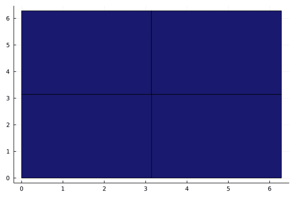

# AdaptiveDensityApproximation

## About

This package introduces the `Grid` and `OneDimGrid` types that approximate density functions. The grids can be refined adaptively, i.e. depending on the  location of the strongest density variation. Simple calculations like sums and products of approximated coefficients and integrals of approximated densities are implemented.


## Installation

This package is not in the general registry and needs to be installed from the GitHub repository by:

```@julia
using Pkg
Pkg.add(url="https://github.com/AntibodyPackages/AdaptiveDensityApproximation")
```

After the installation, the package can be used like any other package:
```@example 1
using AdaptiveDensityApproximation
```

!!! tip "Tip: Plotting grids"
	This package does not include any plotting methods, to reduce the dependencies. However, the package `AdaptiveDensityApproximationRecipes` contains plotting recipes for `Plots.jl`. Again, the package is not in the general registry and needs to be installed from the GitHub repository:
	```@julia
	using Pkg
	Pkg.add(url="https://github.com/AntibodyPackages/AdaptiveDensityApproximationRecipes")
	```

## 1-dim example

In the following, the methods of this package are illustrated on simple, 1-dimensional examples. In some but not all cases tips and additional information are given. For a full documentation of the methods, see the [API](api.md)

### Construct grid and approximate densities

The first step is to create a new one-dimensional grid. For this, axis-ticks need to be defined, i.e. the start/endpoints of the intervals:
```@example 1
using AdaptiveDensityApproximation, AdaptiveDensityApproximationRecipes, Plots
grid = create_grid(LinRange(0,2*pi,10))
```

The grid can be used to approximate a function `f` with `approximate_density!(grid,f)`:

```@example 1
approximate_density!(grid,sin)
plot(grid)
plot!(sin,color = :red, xlims = [0,2*pi], linewidth = 3)
```

!!! tip "Tip: Approximation options"
	The density is approximated by evaluating the function `f` at the center points of the grid. But in some cases, it can be desireable to approximate the density using different evaluation points. The following keywords allow to modify the approximation points:

	* `mode = :mean`: Use the average from the endpoints of the interval / corner points of the block.
	* `mode = :mesh`: Use the average from a mesh of intermediate points.
	* `mesh_size = n`: If `mode = :mesh` use `n` intermediate points (per dimension). The default is 4.
	
	It is also possible to approximate the area under the graph of a density (function value × block volume) by using `volume_normalization = true`.


### Accessing information of the grid

Essentially, a grid is just a collection of values (the weights), together with location information (the blocks of the grid). This data can be exported to allow for a convenient implementation of advanced calculations not covered by this package. The weights can be retrieved by
```@example 1
export_weights(grid)
```
Alternatively, the full information can be exported:
```@example 1
centers, volumes, weights = export_all(grid)
```
The reverse direction, the import of weights is is also possible (at least for the weights):
```@example 1
import_weights!(grid, collect(1:9))
plot(grid)
```


!!! info "Order of blocks"
	For export and import, the intervals/blocks are ordered by their center point. For multidimensional grids, the order is component wise (first dimension precedes second dimension precedes third dimension ...).

### Refine the grid

The grid can be refined (subdividing the blocks that have the largest weight differences to their neighbors) with:

```julia
refine!(grid)
```

!!! info
	A block is subdivided into 2^dim equally-sized subdividing blocks. E.g. an interval is split in the middle into two intervals, a square is split into 4 quatring squares, etc.. 


The functions `approximate_density!` and `refine!` can be used together in a loop to refine the grid adaptively.
```@example 1
grid = create_grid([0,pi/2,pi,3*pi/2,2*pi])

animation = @animate for i in 1:30
	plot(grid)
	approximate_density!(grid,sin)
	refine!(grid)
end
gif(animation,fps=2)
```


!!! tip "Tip: Custom variation and block selection"
	The refine process is a two-step process. First, each block is assigned a variation value. The default variation is the largest absolut weight difference to the neighboring blocks. Then, based on the variation values, the blocks that will be subdivided further are selected (largest variation value by default). It is possible to redefine the block variation assignment and the selection:

	* `block_variation`: Function to calculate the variation value for a block. Must use the following signature `(block_center,block_volume, block_weight, neighbor_center,neighbor_volumes, neighbor_weights)`.
	* `selection`: Function to select the appropriate variation value(s) from. Must have the signature `(variations)`  where variations is a one-dim array of the variation values.

!!! info "Weight splitting"
	The subdividing blocks retain the weight of the original block. If `split_weights = true`, the weight of the original block is split up evenly between the subdividing blocks (i.e. divided by the number of subdividing blocks).


### Restriction of grid domain

For some applications it can be useful to restrict a grid (temporarily) for certain calculations. Consider, for example, a grid that approximates `x->x^2` on the domain `[-1,1]`:

```@example 1
grid = create_grid(LinRange(-1,1,50))
approximate_density!(grid,x-> x^2)
plot(grid)
```
A reasonable domain restriction could be to only allow positive numbers for `x`, i.e. to restrict the grid to `[0,1]`:
```@example 1
restrict_domain!(grid,lower = 0)
plot(grid)
```


### Simple calculations: Sums, products and integrals

Some simple operations are pre-defined for grids (no need to export weights, etc.). For example, the sum of the weights can easily be obtained:
```@example 1
sum(grid)
```
It is also possible to apply a function to all weights before they get summed up / get multiplied together. Furthermore, the grid domain can be restricted temporarily (not mutating the grid).
```@example 1
prod(x-> log(x),grid, lower = 0.5)
```

A grid can also be used for the approximation of an integral. In the case of the restricted grid from above, approximating ``x\mapsto x^2`` on ``[0,1]``, the integral ``\int_0^{1} x^2\ dx \overset{!}{=} \frac{1}{3}`` is approximated:
```@example 1
integrate(grid)
```


### Advanced calculations: Integral models

A more flexible method of integration is the construction of integral models. Consider the general model
```math
	\int f(x,\tau,\varphi(\tau),...) \ d\tau
```
for a density function ``\varphi``. When the density function is approximated by a grid, i.e. by intervals ``I_j`` with centers ``c(I_j)``, volumes ``\text{vol}(I_j)`` and heights ``h(I_j)\approx \varphi(c(I_j))``, the model can be approximated with
```math
	\int f(x,\tau,\varphi(\tau),...) \ d\tau \approx \sum_{j} f(x,c(I_j), h(I_j),\ldots)\cdot \text{vol}(I_j) \ .
```
In general, the implementation of such a model requires a function `f(x,τ,φ(τ),...)` and a grid that approximates the density `φ`. The model can then be obtained with `integral_model(grid,f)`. More precisely:

```@raw html
<div style=" border-style: solid; border-width: 1px; border-radius: 5px; padding: 10px ">
```

```@example 1
@doc integral_model #hide
```

```@raw html
</div> <br>
```


For example, consider `f(x,τ,φ(τ)) = cos(τ * x) * φ(τ) ` for `φ(τ) = sin(τ)` on `[0,2π]`:
```math
\int_0^{2\pi} \cos(\tau\cdot x)  \cdot \text{sin}(\tau) \ d\tau \ .
```
In particular, it holds that:
```math
\int_0^{2\pi} \cos(\tau\cdot 1)  \cdot \text{sin}(\tau) \ d\tau = 0\ .
```
```@example 1
grid = create_grid(LinRange(0,2*pi,30))
approximate_density!(grid,sin)
f(x,τ,φ) = cos(τ*x)*φ
model,weights, components = integral_model(grid,f)
model(1,weights)
```

### Numeric PDF and CDF

When the grid approximates a probability density, i.e. a positive density function, numeric PDF anc CDF functions can be obtained as julia functions.

```@example 1
p(x) = 1/sqrt(2*pi) * exp(-x^2/2)
grid = create_grid(LinRange(-10,10,100))
approximate_density!(grid,p)
plot(grid)
```

The numeric pdf can be obtained with 

```@raw html
<div style=" border-style: solid; border-width: 1px; border-radius: 5px; padding: 10px ">
```

```@example 1
@doc get_pdf #hide
```

```@raw html
</div> <br>
```

The numeric cdf can be obtained with 

```@raw html
<div style=" border-style: solid; border-width: 1px; border-radius: 5px; padding: 10px ">
```

```@example 1
@doc get_cdf #hide
```

```@raw html
</div> <br>
```


For example:
```@example 1
cdf = get_cdf(grid)

plot(cdf, fill = 0, legend = :none)
```

!!! warning
	The function `get_pdf` and `get_cdf` do not check if the weights of the blocks are positive. Negative values can lead to unexpected behavior, e.g. division by zero because of the normalization `1/sum(weights)`.

## Simple 2-dim example

In general, the methods introduced so far are defined for grids of arbitrary dimensions (except for plotting recipes):

```julia
using AdaptiveDensityApproximation, Plots

grid = create_grid([0,pi,2*pi],[0,pi,2pi])
f(x) = sin(x[1])^2 + cos(x[2])^2

animation = @animate for i in 1:100
	plot(grid)
	approximate_density!(grid,f)
	refine!(grid)
end
gif(animation, fps = 4)
```


It is possible to get a lower-dimensional slice from a higher-dimensional grid (slice along the `x`-axis at `y=3` in this case):

```@example 1
grid = create_grid([0,pi,2*pi],[0,pi,2pi]) #hide
f(x) = sin(x[1])^2 + cos(x[2])^2 #hide

for i in 1:100 #hide
	approximate_density!(grid,f) #hide
	refine!(grid) #hide
end #hide

slice = get_slice(grid,[nothing,3])
plot(slice)
```