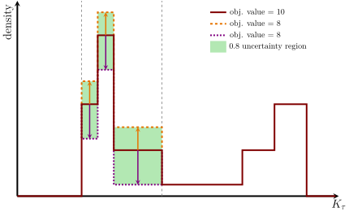

# Uncertainty estimation

The posterior and log-posterior objectives (as used in the [Fitting tutorial](@ref fitting)) from the [FittingObjectiveFunctions](@ref FittingObjectiveFunctions) package belong to a Bayesian data analysis approach. In this analysis regime, it is important to consider not only the best fit but also less probable parameters to estimate the uncertainty of the fit result.

## [`EpitopeUncertainty`](@ref) - construction

The [`EpitopeUncertainty`](@ref) type collects and stores the uncertainty of a ``K_\tau``-density. To illustrate how to obtain an uncertainty estimation, we consider the adaptive fit results from the [Fitting tutorial](@ref fitting):

```@example Uncertainty
using AntibodyMethodsDoseResponseConvenience# hide
using Measures # hide
adaptive_result, data, replicates =  load_results("examples/default_concentrations") # hide
dr_plot = scatter(data, xaxis = :log, label = "data", legend = :topleft) # hide
plot!(adaptive_result.result, label = "adaptive_result.result") # hide
density_plot = plot(DensityPlot(adaptive_result.grid), xaxis = :log, color = 2, fill = 0, fillalpha = 0.5, label = "adaptive_result.grid") # hide
plot(dr_plot, density_plot, layout = (1,2), size = (800,300), margins = 4mm, legend = :topleft) # hide
```

A question of interest could be the uncertainty of the individual peaks. For this, the index-bins belonging to the different peaks need to be identified. Using [`peak_detection`](@ref) and setting the threshold to `0.01` results in:

```@example Uncertainty
bins, ranges = peak_detection(adaptive_result.grid, 0.01)
```
[`peak_detection`](@ref) returns the identified peaks both as bins (indices of intervals) and the grid-domain ranges. By default, the regions between peaks are also included (`fill = true`) and the peaks are determined with `volume_normalization = :log` (see [Background: log-volume normalization](@ref log_volume_normalization)).

!!! info
	For plotting purposes ([`bin_analysis_plot`](@ref), [`peak_analysis_plot`](@ref)), the bins need to specify the grid-domain ranges, e.g. `[[1e-10,1e-8],[1e-5,1e-3]]`. For the uncertainty estimation and uncertainty plotting ([`uncertainty_plot`](@ref)), the bins need to specify the grid intervals that are varied, e.g. `[[1,2,3],[5,8]]`.

!!! tip
	Defining grid-domain ranges is often easier than figuring out which gird intervals belong to these ranges. The [`select_indices`](@ref) function allows to pick the interval indices belonging to a gird-domain range.

Having defined the interval groups, the uncertainty can be estimated by fixing all parameters to the fit result, shifting uniformly only the parameters belonging to the current group of interest. This process is then repeated for all interval groups. Evaluating the objective function for each shift allows to estimate the uncertainty of the interval group.



This uncertainty estimation from bin-wise shifting can be obtained with the following [`EpitopeUncertainty`](@ref) constructor:
```julia
adaptive_options = AdaptiveOptions(objective = :log_posterior, 
		prior_generator = scaled_log_volume_prior(500),
		offset = adaptive_result.optimizer[end]
		)

eu = EpitopeUncertainty(data,adaptive_result.grid, bins, 
		levels = [1e-10,1e-5,0.1,0.25,0.5,0.75,0.9,1], 
		options = adaptive_options
		)
```
```@example Uncertainty
eu = deserialize("examples/uncertainty/eu.jld") # hide
```

The bin-wise shifting constructor [`EpitopeUncertainty`](@ref) generates the objective function automatically, using the same methods as [`adaptive_dose_response_fit`](@ref), hence the need for an [`AdaptiveOptions`](@ref) object. In the example above, the options were chosen to match those from the [Fitting tutorial](@ref fitting) section.

Notice the `offset = adaptive_result.optimizer[end]` line. Since the default fitting algorithm that was recreated in the [Fitting tutorial](@ref fitting) section uses the offset parameter, the estimated offset must be added to the uncertainty estimation, as it shifts up the resulting dose-response curve globally. Recall, that the offset parameter is the last element of the returned `optimizer` field of an [`AdaptiveResult`](@ref) object.

Finally, the uncertainty levels are specified as fractions of the best objective value.

!!! info "uncertainty estimation from samples"
	There is also an [`EpitopeUncertainty`](@ref) constructor that uses samples, drawn from a posterior or log-posterior objective. However, the sample constructor does not support the selection of bins. Quantiles corresponding to the chosen levels are calculated for each parameter individually. Furthermore, no sample algorithm is provided by the `AntibodyMethods` packages.

## [`EpitopeUncertainty`](@ref) - plotting

The `AntibodyMethodsDoseResponseRecipes` package provides a plotting recipe for [`EpitopeUncertainty`](@ref) objects. To define the color-gradient for the uncertainty visualization, the `Colors.jl` package is needed as well. Both packages (and also `Plots.jl`) are automatically exported by the [`AntibodyMethodsDoseResponseConvenience`](@ref api_convenience) package. The [`EpitopeUncertainty`](@ref) object `eu` can be plotted by passing the grid `adaptive_result.grid` and the [`EpitopeUncertainty`](@ref) object `eu` to the `plot` function:

```@example Uncertainty
uncertainty_colors =colormap("RdBu", 8)[end:-1:1]
plot(adaptive_result.grid, eu, xaxis = :log, legend = :topleft,
	colors = uncertainty_colors, 
	hide_labels = false,
	bins = bins
	)
```

The `colormap` function from `Colors.jl` creates an array of colors (here `8` colors, which matches the number of uncertainty `levels`). The `[end:-1:1]` is used to reverse the colors (now from blue to red). Thus, the lower levels (less certain) are blue while the best result is red.

#### Keywords with default arguments

* `volume_normalization = :log`: The volume-normalization as discussed in [Background: log-volume normalization](@ref log_volume_normalization).
* `colors = [:gray]`: An array of colors (that `Plots.jl` accepts for the `color` keyword) that correspond to the different uncertainty levels. If the array contains less colors than uncertainty levels, the last color is repeated for the remaining levels.
* `opacities = [1]`: Array of opacities (number between `0` and `1`) that correspond to the different uncertainty levels. Again, the last opacity is repeated if there are more uncertainty levels than opacities.
* `reverse = false`: If `true` the plotting order of the uncertainty levels is reversed. Since the uncertainty ranges are plotted on top of each other, this can become necessary when the [`EpitopeUncertainty`](@ref) constructor for samples is used, where larger levels correspond to larger uncertainty (as opposed to the bin-wise shifting constructor). 
* `hide_labels = true`: If `true` the labels are omitted. Can become necessary when a large number of uncertainty levels is used.
* `bins = nothing`: Specifies the positions for the bin-markers (dashed lines). The bins should be the same as those used in the [`EpitopeUncertainty`](@ref) constructor. If `nothing`, bin markers are omitted.
* `bin_color = :gray`: Color of the bin markers.

!!! warning "Interpretation of the uncertainty"
	As explained above, the uncertainty is estimated by keeping all bins fixed, only shifting one bin at a time. Thus, the bin uncertainties have to be considered individually. 
	
	It is not admissible to combine the uncertainty of the bins: e.g. to consider shifting the first peak up and shifting the second peak down within the `1e-10` uncertainty region and then to declare this to have the uncertainty `1e-10`.

	It is not admissible to consider partial shifts within a bin: e.g. shifting only the tip of the first peak, but not the other parts of the peak. The uncertainty level is only valid for the uniform shift of all parameters within a bin.

## [`DoseResponseUncertainty`](@ref) - construction

Given an [`EpitopeUncertainty`](@ref) object and the corresponding grid, a [`DoseResponseUncertainty`](@ref) object can be created. In essence, the dose-response uncertainty is obtained by simulating dose-response curves for the different parameters contained in the [`EpitopeUncertainty`](@ref) object. Hence, the concentrations that these dose-responses are simulated for need to be passed explicitly:

```julia
concentrations = LogRange(extrema(data.independent)...,100)
du = DoseResponseUncertainty(adaptive_result.grid, eu, concentrations, bins = bins)
```
```@example Uncertainty
du = deserialize("examples/uncertainty/du.jld") # hide
```

The same `bins` that were used to create the [`EpitopeUncertainty`](@ref) object should also be used for the [`DoseResponseUncertainty`](@ref) constructor. This is, because the dose-response uncertainty is calculated as point-wise maximum/minimum over the effect of the individual uncertainty-variation of each bin. The following example illustrates the dose-response uncertainties that result from the individual peak uncertainties (dashed lines), both for the same uncertainty level. The green ribbon shows the resulting overall dose-response uncertainty (for the same uncertainty level):

```@example Uncertainty
concentrations = LogRange(extrema(data.independent)...,100) # hide

grid_A = deepcopy(adaptive_result.grid) # hide
grid_B = deepcopy(adaptive_result.grid) # hide
cutoff = select_indices(grid_A, lower = 1e-5)[1] # hide
println(cutoff) # hide

weights_A = export_weights(grid_A) # hide
weights_A[1:cutoff] .= weights_A[1:cutoff] .* 1.2 # hide
import_weights!(grid_A, weights_A) # hide

weights_B = export_weights(grid_B) # hide
weights_B[cutoff:end] .= weights_B[cutoff:end] .* 1.4 # hide
import_weights!(grid_B, weights_B) # hide

dr_fit = DoseResponseResult(adaptive_result.grid, concentrations) # hide
dr_A = DoseResponseResult(grid_A, concentrations) # hide
dr_B = DoseResponseResult(grid_B, concentrations) # hide
dr_sum = DoseResponseResult(concentrations, max.(dr_A.responses,dr_B.responses)) # hide

plot(dr_fit, xaxis = :log, color = :red, label = "best fit", legend = :topleft, linewidth = 3, xlabel = "concentration", ylabel = "response") # hide
plot!(dr_sum, color = :green, label = "component maxiumum", linewidth = 0, fill = dr_fit.responses, fillalpha = 0.5) # hide
plot!(dr_A,  linestyle = :dash, color = :blue, label = "peak 1 variation", linewidth = 2.5) # hide
plot!(dr_B,  linestyle = :dashdotdot, color = "Blue Violet", label = "peak 2 variation", linewidth = 2.5) # hide
```


Furthermore, note that `concentrations` covers the same concentration range as the dose-response data points, but contain much more intermediate concentrations:
```@example Uncertainty
println(data.independent)
println(concentrations)
```

!!! tip
	Using more intermediate concentrations is recommended to avoid jagged lines.

## [`DoseResponseUncertainty`](@ref) - plotting

As before, `AntibodyMethodsDoseResponseRecipes` provides a plotting recipe for [`DoseResponseUncertainty`](@ref) objects:

```@example Uncertainty
plot(du, xaxis = :log, legend = :topleft, colors = uncertainty_colors, hide_labels = false)
scatter!(data, color = "Dark Orange", label = "data") # compare uncertainty with data
```

#### Keywords with default arguments

* `filter_zeros = [true, false]`: Remove zero-values from the plot (works the same as explained in [Measurement data - Plotting](@ref measurement_data_plotting)).
* `colors = [:gray]`: Same as [`EpitopeUncertainty`](@ref) plotting above
* `opacities = [1]`: Same as [`EpitopeUncertainty`](@ref) plotting above
* `reverse = false`: Same as [`EpitopeUncertainty`](@ref) plotting above
* `hide_labels = true`: Same as [`EpitopeUncertainty`](@ref) plotting above

!!! warning "Interpretation of the uncertainty"
	As explained above, the uncertainty is estimated by keeping all bins fixed, only using the uncertainty estimation of one bin at a time. Then, the dose-response curves are simulated. For each concentration, the maximal/minimal value is estimated for all bins.  Thus, comparing the dose-response uncertainty with the uncertainty of an individual peak is not directly possible. It rather shows the worst-case uncertainty if any of the peaks (but only one) would be shifted within a certain uncertainty level.
	
	Nevertheless, it is possible to gauge the uncertainty effect of a single peak, by considering only the concentration region of the dose-response curve that matches the ``K_\tau`` region of the peak.

!!! info "Why component wise maxima/minima?"
	The component-wise maxima/minima are just a compromised way to combine the uncertainty corresponding to all the individual peaks into a single plot. Using a different plot for each peak would be less confusing, but less concise. Also, the component-wise maxima/minima do not correspond to the overall uncertainty, i.e. when all peaks are shifted within an uncertainty level at the same time. [Example: Total uncertainty](@ref total_uncertainty) shows how to obtain the total dose-response uncertainty.


!!! tip "Different plots for different aspects"
	Combining to many aspects into a single plot leads to misinterpretation. Choosing different bins allows to obtain different uncertainty estimations, as the examples below show.


## Plotting with [`uncertainty_plot`](@ref)

Since the uncertainty estimation involves various subtleties, it is not discussed in the [quick start guide](@ref quick_start). However, the [`AntibodyMethodsDoseResponseConvenience`](@ref api_convenience) package contains a convenience function ([`uncertainty_plot`](@ref)) to create the uncertainty plots with. The available methods to customize the plots are discussed in [quick start: plotting options](@ref plotting_options).


The plots from above can be recreated with [`uncertainty_plot`](@ref):
```@example Uncertainty
du_plot, eu_plot = uncertainty_plot(eu,du,adaptive_result.grid,
		eu_arguments = eu_options(8, bins, hide_labels = false),
		du_arguments = du_options(8, hide_labels = false)
		)
```

Both [`eu_options`](@ref) and [`du_options`](@ref) expect the number of uncertainty levels as first argument. [`eu_options`](@ref) takes the `bins` as second, optional argument. Then, the respective uncertainty-plot keywords discussed above can be added to [`eu_options`](@ref) and [`du_options`](@ref).

```@example Uncertainty
plot(eu_plot)
```

```@example Uncertainty
plot(du_plot)
scatter!(data, color = "Dark Orange", label = "data") # plot data points on top
```


## Rescale the bin-wise shifts

By default (`volume_normalization = :none`), all weights within the same bin are shifted uniformly. However, the corresponding intervals may have different lengths. And the contribution of an interval is given by the product `weight × interval length`. Hence, scaling the wight shifts according to their corresponding interval length provides a further uncertainty estimation from bin-wise weight shifting. For this, the `volume_normalization = :linear` keyword can be used in the [`EpitopeUncertainty`](@ref) constructor, leading to

```@example Uncertainty
eu = deserialize("examples/uncertainty_volume/eu.jld") # hide
du = deserialize("examples/uncertainty_volume/du.jld") # hide

du_plot, eu_plot = uncertainty_plot(eu,du,adaptive_result.grid, eu_arguments = eu_options(8, bins, hide_labels = false), du_arguments = du_options(8, hide_labels = false)) # hide

du_plot = plot(du_plot) # hide
scatter!(data, color = "Dark Orange", label = "data") # hide

plot(eu_plot, du_plot, layout = (1,2), size = (800,300), margins = 3mm) # hide
```
Observe that the shifts become larger for larger `K_\tau` values. Although the intervals appear to have the same lengths, the intervals further right in the plot are larger, because of the logarithmic plot. Hence, the shifts, when scaled by the interval length, become larger. Note that this behavior is universal, i.e. not necessarily depending on the uncertainty itself but on the fact of the unequal size of intervals of a logarithmic scale.


As mentioned in [Background: log-volume normalization](@ref log_volume_normalization), it is in fact the visual area of the intervals in the logarithmic plot that corresponds to the dose-response effect of the interval. Thus, scaling the shifts with the visual lengths of the intervals, as they appear in a logarithmic plot, is another approach to investigate the uncertainty with bin-wise weight shifting. This can be achieved by `volume_normalization = :log`:

```@example Uncertainty
eu = deserialize("examples/uncertainty_log_volume/eu.jld") # hide
du = deserialize("examples/uncertainty_log_volume/du.jld") # hide

du_plot, eu_plot = uncertainty_plot(eu,du,adaptive_result.grid, eu_arguments = eu_options(8, bins, hide_labels = false), du_arguments = du_options(8, hide_labels = false)) # hide

du_plot = plot(du_plot) # hide
scatter!(data, color = "Dark Orange", label = "data") # hide

plot(eu_plot, du_plot, layout = (1,2), size = (800,300), margins = 3mm) # hide
```
Since the intervals have the about the same length in the logarithmic plot, the shifts are almost identical (for the respective bin).


!!! info
	In summary, the different re-scalings of the shifts provide additional methods to investigate the uncertainty differently. Since bin-wise shifts only approximate the uncertainty roughly (as sampling is computationally expensive), different scalings reveal different aspects of the uncertainty, by testing different configuration of deviation from the best fit. Hence, no scaling is superior to the others, they just answer slightly different questions about the uncertainty.


## [Example: Uncertainty of a single peak](@id of_single_peak)

The interpretation of the uncertainty plots can be tricky at times, which is addressed by the warnings above. In the example above, it is not possible to compare the dose-response uncertainty with the uncertainty of a single bin. To do so, the uncertainty estimation needs to be restricted to a single peak:

```@example Uncertainty
temp_bins, temp_ranges = peak_detection(adaptive_result.grid, 0.01)
bins = [temp_bins[2]]
println(bins) # hide
```
Using `[temp_bins[2]]` creates a vector of bins, in this case with only a single bin - the second peak from left. Simply using `temp_bins[2]` will not work; it will create separate bins, each containing only a single element.

Now, the uncertainty estimation proceeds as before:

```julia
adaptive_options = AdaptiveOptions(objective = :log_posterior, 
		prior_generator = scaled_log_volume_prior(500),
		offset = adaptive_result.optimizer[end]
		)

eu = EpitopeUncertainty(data,adaptive_result.grid, bins, 
		levels = [1e-10,1e-5,0.1,0.25,0.5,0.75,0.9,1], 
		options = adaptive_options
		)

concentrations = LogRange(extrema(data.independent)...,100)
du = DoseResponseUncertainty(adaptive_result.grid, eu, concentrations, bins = bins)
```
```@example Uncertainty
eu = deserialize("examples/uncertainty_single/eu.jld") # hide
du = deserialize("examples/uncertainty_single/du.jld") # hide
```

These uncertainty objects produce the following plots:

```@example Uncertainty
using Measures # hide

du_plot, eu_plot = uncertainty_plot(eu,du,adaptive_result.grid, eu_arguments = eu_options(8, bins, hide_labels = false), du_arguments = du_options(8, hide_labels = false)) # hide

du_plot = plot(du_plot) # hide
scatter!(data, color = "Dark Orange", label = "data") # hide

plot(eu_plot, du_plot, layout = (1,2), size = (800,300), margins = 3mm) # hide
```


!!! info "Interpretation"
	In this case, the uncertainty of the dose-response curve corresponds exclusively to the uncertainty of the middle peak (other uncertainties have not been estimated).


## [Example: Uncertainty in a single peak](@id in_single_peak)

In the example above, the use of `[temp_bins[2]]` was emphasized. Using `temp_bins[2]` will create single-element bins (that are contained in the bin `temp_bin[2]`). Internally, single-element arrays are converted to `[[elm] for elm in collection]`.

But it is worthwhile to consider this case. It corresponds to the uncertainty of the individual parameters in `temp_bin[2]`, where one parameter at a time is varied, keeping the rest fixed to the best fit result.

```@example Uncertainty
temp_bins, temp_ranges = peak_detection(adaptive_result.grid, 0.01)
bins = temp_bins[2]
println(bins) # hide
```

The uncertainty estimation and plotting work as before:

```@example Uncertainty
using Measures # hide
eu = deserialize("examples/uncertainty_split/eu.jld") # hide
du = deserialize("examples/uncertainty_split/du.jld") # hide

du_plot, eu_plot = uncertainty_plot(eu,du,adaptive_result.grid, eu_arguments = eu_options(8, bins, hide_labels = false), du_arguments = du_options(8, hide_labels = false)) # hide

du_plot = plot(du_plot) # hide
scatter!(data, color = "Dark Orange", label = "data") # hide

plot(eu_plot, du_plot, layout = (1,2), size = (800,300), margins = 3mm) # hide
```


!!! info "Interpretation"
	The same warnings as before apply. The uncertainty of only the individual parameters (in this case) can be deduced from this plot, as is also indicated by the bin markers. It is not valid to combine the uncertainties (e.g. move one parameter up and its neighbor down). Also, the uncertainty of a single parameter cannot be compared directly to the dose-response uncertainty. 


## [Example: Global uncertainty](@id global_uncertainty)

The example [Uncertainty of a single peak](@ref of_single_peak) indicates how to estimate the global-shift uncertainty:

```@example Uncertainty
bins = [collect(1:length(adaptive_result.grid))]
```

The uncertainty estimation and plotting work as before:

```@example Uncertainty
using Measures # hide
eu = deserialize("examples/uncertainty_global/eu.jld") # hide
du = deserialize("examples/uncertainty_global/du.jld") # hide

du_plot, eu_plot = uncertainty_plot(eu,du,adaptive_result.grid, eu_arguments = eu_options(8, hide_labels = false), du_arguments = du_options(8, hide_labels = false)) # hide

du_plot = plot(du_plot) # hide
scatter!(data, color = "Dark Orange", label = "data") # hide

plot(eu_plot, du_plot, layout = (1,2), size = (800,300), margins = 3mm) # hide
```


!!! info "Interpretation"
	Here, the complete ``K_\tau``-density is shifted (globally). Since this is the only "bin", the dose-response uncertainty corresponds directly to this uncertainty. Again, it is not admissible to consider individual parameters/peaks/parts moving in different directions. The result is only valid for global/uniform shifts. 


## [Example: Individual uncertainty](@id individual_uncertainty)

The example [Uncertainty in a single peak](@ref in_single_peak) indicates how to estimate the uncertainty for all parameters individually:

```@example Uncertainty
bins = collect(1:length(adaptive_result.grid))
println(bins) # hide
```

The uncertainty estimation and plotting work as before:

```@example Uncertainty
using Measures # hide
eu = deserialize("examples/uncertainty_total/eu.jld") # hide
du = deserialize("examples/uncertainty_total/du.jld") # hide

du_plot, eu_plot = uncertainty_plot(eu,du,adaptive_result.grid, eu_arguments = eu_options(8, bins = collect(1:length(adaptive_result.grid)),  hide_labels = false), du_arguments = du_options(8, hide_labels = false)) # hide

du_plot = plot(du_plot) # hide
scatter!(data, color = "Dark Orange", label = "data") # hide

plot(eu_plot, du_plot, layout = (1,2), size = (800,300), margins = 3mm) # hide
```

!!! info "Interpretation"
	The same warnings as before apply. The uncertainty of only the individual parameters (in this case) can be deduced from this plot, as is also indicated by the bin markers. It is not valid to combine the uncertainties (e.g. move one parameter up and its neighbor down). Also, the uncertainty of a single parameter cannot be compared directly to the dose-response uncertainty. 


## [Example: Total uncertainty](@id total_uncertainty)

So far, the same `bins` were used for both the [`EpitopeUncertainty`](@ref) and the [`DoseResponseUncertainty`](@ref). But, this is not a requirement. It is possible to combine different bins to obtain different uncertainty visualizations. For example, this allows to estimate the total uncertainty. For this, the uncertainties of the individual parameters of the ``K_\tau`` density are estimated as in [Example: Individual uncertainty](@ref individual_uncertainty):

```@example Uncertainty
epitope_bins = collect(1:length(adaptive_result.grid))
println(epitope_bins) # hide
```

```julia
adaptive_options = AdaptiveOptions(objective = :log_posterior, 
		prior_generator = scaled_log_volume_prior(500),
		offset = adaptive_result.optimizer[end]
		)

eu = EpitopeUncertainty(data,adaptive_result.grid, epitope_bins, 
		levels = [1e-10,1e-5,0.1,0.25,0.5,0.75,0.9,1], 
		options = adaptive_options
		)

```
```@example Uncertainty
eu = deserialize("examples/uncertainty_total/eu.jld") # hide
```

Then, the [`DoseResponseUncertainty`](@ref) is constructed but with the global `bin` from [Example: Global uncertainty](@ref global_uncertainty):

```@example Uncertainty
dr_bins = [collect(1:length(adaptive_result.grid))]
concentrations = LogRange(extrema(data.independent)...,100)
du = DoseResponseUncertainty(adaptive_result.grid, eu, concentrations, bins = dr_bins)
```

```@example Uncertainty
using Measures # hide

du_plot, eu_plot = uncertainty_plot(eu,du,adaptive_result.grid, eu_arguments = eu_options(8, bins = epitope_bins,  hide_labels = false), du_arguments = du_options(8, hide_labels = false)) # hide

du_plot = plot(du_plot) # hide
scatter!(data, color = "Dark Orange", label = "data") # hide

plot(eu_plot, du_plot, layout = (1,2), size = (800,300), margins = 3mm) # hide
```

	
!!! info "Interpretation"
	For the uncertainty of the ``K_\tau``-density, the interpretation of the uncertainty levels is the same as before in [Example: Individual uncertainty](@ref individual_uncertainty) and [Example: Uncertainty in a single peak](@ref in_single_peak). Only a single parameter at a time can be considered while keeping the other parameters fixed to the best fit result.

	However, the correspondence between the dose-response uncertainty and the density uncertainty is different. An uncertainty level in the dose-response plot now corresponds to any parameter **combination** in the density plot that is withing the same uncertainty level.